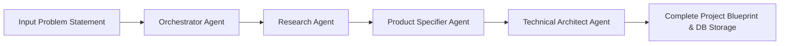

# ⚔️ HackForge AI — Autonomous Multi-Agent Project Blueprint

> **Transforming Hackathon Problem Statements into Complete Technical Blueprints in Seconds.**


---

## 📋 Executive Overview

**HackForge AI** is an autonomous multi-agent platform designed for hackathons and rapid prototyping. It ingests raw hackathon problem statements and orchestrates specialized **LangGraph stateful agents** to synthesize:

1. **Problem Analysis & Market Feasibility**
2. **Product Specification & Feature Roadmap (MVP vs Phase 2)**
3. **Technical Architecture (Microservices, Database Schemas & REST APIs)**

---

## 🤖 Multi-Agent Workflow Graph



### Agent Responsibilities
* **Orchestrator Agent:** Validates input parameters, initializes graph execution state, and coordinates agent transitions.
* **Research Agent:** Performs domain classification, analyzes root causes, identifies target user personas, and evaluates hackathon feasibility scores.
* **Product Specifier Agent:** Generates 24-48h MVP core features, post-hackathon roadmap, key user stories, and UX workflows.
* **Technical Architect Agent:** Formulates recommended technology stacks, designs relational entity database schemas, and drafts REST API endpoint contracts.

---

## 📊 Sample Generated Blueprint: HackForge AI Platform

### 1. Research Analysis
* **Domain Category:** AI Multi-Agent Systems & Developer Automation Tools
* **Feasibility Score:** **92/100**
* **Core Problem:** Manual setup and planning consume 30%+ of time during 24-48 hour hackathons. Teams struggle to align on database schemas, feature scoping, and API contracts early.
* **Target Audience:** Hackathon Participants, Startup Founders, Software Architects, and DevOps Teams.
* **Unique Value Proposition:** Eliminates initial planning friction by generating production-ready technical architecture specs in under 15 seconds.

### 2. Product Specification

#### MVP Features (24-48h Scope)
* **Problem Statement Parser:** Interactive input portal with real-time intent extraction and customizable preset ideas.
* **Stateful LangGraph Engine:** 4-node execution graph supporting sequential and parallel multi-agent synthesis.
* **Interactive Blueprint Visualizer:** Rich tabbed dashboard displaying research cards, database schemas, and REST API definitions.
* **Markdown Exporter:** One-click generation and download of complete `BLUEPRINT.md` files.

#### Phase 2 Features
* **Automated GitHub Scaffolder:** One-click creation of pre-configured GitHub repositories with Docker & CI/CD workflows.
* **AI Code Workbench:** Automated boilerplate generation for FastAPI routes and SQLAlchemy models.

#### Key User Stories
* *"As a hackathon team lead, I want to input our problem statement so that my team gets an instant technical architecture spec."*
* *"As a developer, I want to review recommended API contracts and database schemas so I can start coding routes immediately."*

---

## 🏗️ Technical Architecture Specification

### Recommended Tech Stack
| Tier | Technology | Description |
|---|---|---|
| **Frontend** | **Next.js 14 (App Router)** | TypeScript, Tailwind CSS, Lucide Icons |
| **Backend** | **Python & FastAPI** | Uvicorn, Pydantic v2, Async HTTP |
| **AI Orchestration** | **LangGraph & LangChain** | Stateful Directed Agent Graph |
| **Database** | **PostgreSQL / SQLite** | SQLAlchemy ORM with `pgvector` extension |
| **Deployment** | **Vercel & Render** | Global CDN Frontend + Async Microservices |

### Database Schema Design (`blueprints` Table)
```sql
CREATE TABLE blueprints (
    id VARCHAR(36) PRIMARY KEY,
    title VARCHAR(255) NOT NULL,
    problem_statement TEXT NOT NULL,
    problem_analysis JSONB,
    product_spec JSONB,
    technical_architecture JSONB,
    status VARCHAR(50) DEFAULT 'completed',
    created_at TIMESTAMP WITH TIME ZONE DEFAULT CURRENT_TIMESTAMP,
    updated_at TIMESTAMP WITH TIME ZONE DEFAULT CURRENT_TIMESTAMP
);
```

### REST API Contracts

#### `POST /api/generate`
Triggers the multi-agent graph execution pipeline.
* **Request Body:**
  ```json
  {
    "problem_statement": "Build an autonomous AI agent for medical triage"
  }
  ```
* **Response:** Returns complete `ProjectState` payload containing `research_data`, `product_spec`, and `architecture_spec`.

---

## 🚀 Getting Started

### 1. Clone Repository
```bash
git clone https://github.com/Ahm3dh-sham/Hackathon-AI.git
cd Hackathon-AI
```

### 2. Run Backend (FastAPI)
```bash
cd backend
pip install -r requirements.txt
python main.py
```
*API running at `http://localhost:8000` | Swagger Docs at `http://localhost:8000/docs`*

### 3. Run Frontend (Next.js)
```bash
cd frontend
npm install --legacy-peer-deps
npm run dev
```
*Web App running at `http://localhost:3000` or `http://127.0.0.1:3000`*

---
*Built with ❤️ for Hackathons using LangGraph, FastAPI, and Next.js.*
