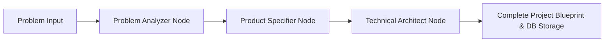

# HackForge AI — Autonomous Multi-Agent AI Platform

HackForge AI is an autonomous multi-agent platform designed for hackathons. It transforms a raw hackathon problem statement into a comprehensive project blueprint encompassing **Problem Analysis**, **Product Specification**, and **Technical Architecture**.

---

## 🌟 Tech Stack

### **Backend**
* **Framework:** Python, FastAPI, Uvicorn
* **Agent Engine:** LangGraph, LangChain, Google Gemini API
* **Data Modeling:** Pydantic v2
* **ORM & Database:** SQLAlchemy, SQLite (default) / PostgreSQL (with `pgvector`)

### **Frontend**
* **Framework:** Next.js 15 (App Router), React 19, TypeScript
* **Styling:** Tailwind CSS, Glassmorphism design system
* **Icons:** Lucide React

---

## 📁 Repository Structure

```text
hackforge-ai/
├── backend/
│   ├── app/
│   │   ├── agents/          # LangGraph state graph, nodes, state schemas
│   │   │   ├── nodes/       # problem_analyzer.py, product_specifier.py, architect.py
│   │   │   ├── graph.py     # StateGraph workflow runner
│   │   │   └── state.py     # AgentState definition
│   │   ├── api/             # REST endpoints (routes.py)
│   │   ├── core/            # Environment settings (config.py)
│   │   ├── models/          # SQLAlchemy database tables (database.py)
│   │   └── schemas/         # Pydantic schemas (pydantic_models.py)
│   ├── main.py              # FastAPI server entrypoint
│   └── requirements.txt
└── frontend/
    ├── src/
    │   ├── app/             # page.tsx, layout.tsx, globals.css, api/
    │   ├── components/      # InputForm.tsx, BlueprintDisplay.tsx
    ├── package.json
    ├── tailwind.config.ts
    └── tsconfig.json
```

---

## 🚀 Quick Start Guide

### 1. Run the Backend API

```bash
cd backend
python -m venv venv
# On Windows:
venv\Scripts\activate
# On Linux/macOS:
# source venv/bin/activate

pip install -r requirements.txt
python main.py
```

The FastAPI backend will start at `http://localhost:8000`. Access Swagger UI docs at `http://localhost:8000/docs`.

### 2. Run the Frontend App

```bash
cd frontend
npm install
npm run dev
```

The Next.js frontend will run at `http://localhost:3000`.

---

## 🤖 Multi-Agent Workflow Engine



1. **Problem Analyzer Node**: Extracts core problem, target audience, pain points, value proposition, and hackathon feasibility score.
2. **Product Specifier Node**: Constructs MVP core features (24-48h scope), Phase 2 roadmap, key user stories, and UX workflow.
3. **Technical Architect Node**: Designs recommended tech stack, microservices/components, database schema, and REST API contracts.
